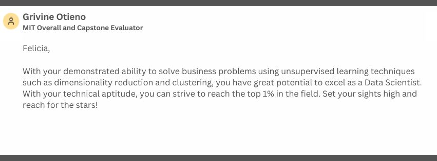
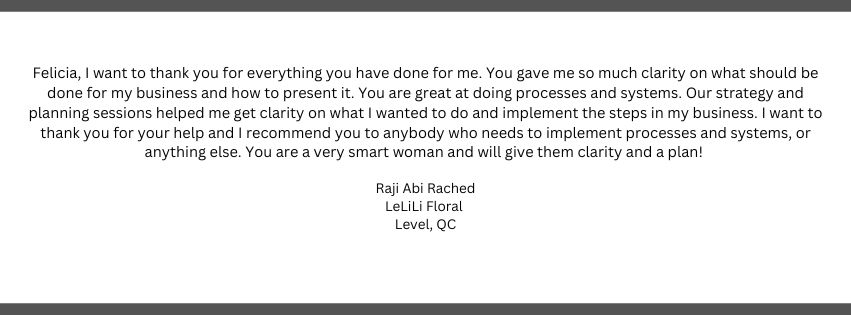
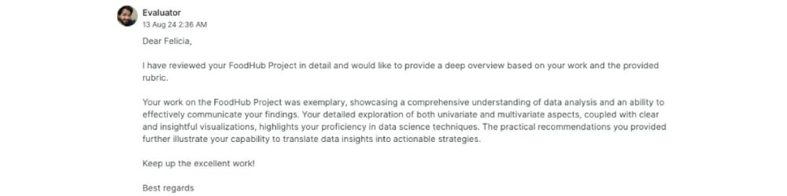
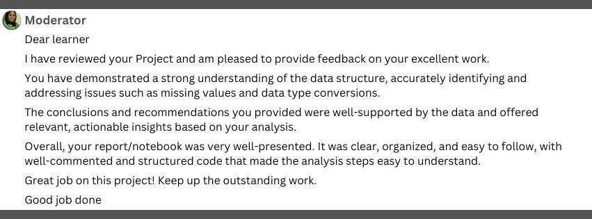
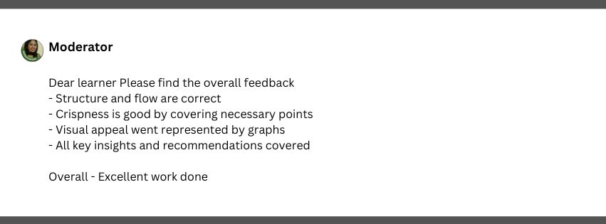

# Financial Services - Operations Analyst & Strategic Processes Leadership

## <ins>Professional Summary</ins>
Director of Operations with extensive experience leading wealth management operations, trading execution, and financial
process governance within broker-dealer and RIA environments. FINRA-licensed General Securities Representative and
MIT-trained Data Analyst with expertise in investment operations, account funding workflows, portfolio allocation
implementation, cash management, and operational risk mitigation.

Proven leader in designing scalable operational frameworks, internal control systems, and reporting dashboards to
improve trading accuracy, workflow transparency, regulatory alignment, and service efficiency. Advanced proficiency in
Excel (automation, financial modeling, complex formulas) and Python for data analysis and process optimization.
Experienced in cross-functional leadership, HR administration, vendor coordination, and operational strategy within
growth-focused financial institutions.
              
## <ins>Education</ins>
- MASSACHUSETTS INSTITUTE OF TECHNOLOGY 
- UNIVERSITY OF SOUTHERN MISSISSIPPI 

## <ins>Licenses and Certifications</ins>
- **Licenses:** &nbsp;&nbsp;Series 7 &nbsp;&nbsp;·&nbsp;&nbsp; SIE &nbsp;&nbsp;·&nbsp;&nbsp; Life & Health
- **Certifications:** &nbsp;&nbsp;Master Financial Coach

## <ins>Skills</ins>
- Wealth Management Operations &nbsp;&nbsp;·&nbsp;&nbsp; Investment & Trading Operations &nbsp;&nbsp;·&nbsp;&nbsp; Portfolio Allocation & Cash Management &nbsp;&nbsp;·&nbsp;&nbsp; Operational Risk & Internal Controls &nbsp;&nbsp;·&nbsp;&nbsp; Process Improvement & Workflow Governance &nbsp;&nbsp;·&nbsp;&nbsp; Regulatory Reporting & Compliance Support &nbsp;&nbsp;·&nbsp;&nbsp; Account Funding & Money Movement &nbsp;&nbsp;·&nbsp;&nbsp; Vendor & Broker-Dealer Coordination
- Advanced Excel (Automation, Financial Modeling, Complex Formulas, Macros) &nbsp;&nbsp;·&nbsp;&nbsp; Python (Data Analysis & Process Automation) &nbsp;&nbsp;·&nbsp;&nbsp; ADP Workforce Management &nbsp;&nbsp;·&nbsp;&nbsp; Salesforce and Redtail CRM &nbsp;&nbsp;·&nbsp;&nbsp; MoneyGuidePro and eMoney Advisor &nbsp;&nbsp;·&nbsp;&nbsp; Holistaplan &nbsp;&nbsp;·&nbsp;&nbsp; Nitrogen / Riskalyze &nbsp;&nbsp;·&nbsp;&nbsp; Envestnet

## <ins>Experience</ins> 
### ▪️ DIRECTOR OF OPERATIONS ▪️
***Ameriprise Financial - Crown Financial Group  |  07/2025 – 02/2026***
- Led firm-wide operations, trading execution, HR administration, and process governance within a multifunctional
wealth management advisory practice.
- Designed and implemented scalable operational frameworks to improve account funding workflows, trade
execution accuracy, and service transparency.
- Architected integrated Excel-based trading and reporting dashboards consolidating multiple Ameriprise reports to
automate allocation calculations, cash reserve thresholds, and share quantity execution.
- Reduced trade processing time by 50%.
- Identified and corrected uninvested and misaligned accounts, mitigating allocation risk and strengthening internal
controls.
- Established standardized task governance system to manage ongoing client service workflows and reduce
operational bottlenecks.
- Oversaw ADP timekeeping system and developed internal HR policies, performance standards, and attendance
protocols.
- Partnered with advisors and back-office teams to align operational processes with broker-dealer compliance
standards.

 

### ▪️ SYSTEMS AND OPERATIONS ANALYST ▪️
***Cetera Advisor Networks - Shoemaker Financial, RIA  |  04/2020 – 06/2025***
- Oversaw and validated reporting accuracy across $1.11B in managed assets, strengthening data integrity and
regulatory reporting reliability.
- Identified and resolved system-level coding error impacting ~1,000 accounts during regulatory reporting period,
preventing material processing delays and compliance risk exposure.
- Spearheaded, implemented roadmaps, and carried out multiple projects to understand and resolve issues affecting
business operations, and solve framework needs around operational processes.
- Impacted organizational change by providing insights on business processes along with actionable changes and/or
improvements.

 

### ▪️ SENIOR PRACTICE MANAGER, FINANCIAL SERVICES PROFESSIONAL ▪️
***Cetera Advisor Networks - Shoemaker Financial, RIA  |  04/2020 – 06/2025***
- Developed close working relationships and collaborated with outside vendors, back-office professionals, and home
office management on business decisions and problem resolutions.
- Served as primary operational escalation point for advisors and staff, resolving complex account, vendor, and system
issues.
- Developed and maintained manual databases for over $312 million in assets to satisfy reporting where software
systems lacked capabilities.
- Managed end-to-end client account operations, service workflows, and advisory support across onboarding,
maintenance, and regulatory servicing.
- Successfully negotiated several million in client account retainment to maintain and create increased revenue.
- Produced yearly reports to comply with financial regulations and best practices.
- Effectively answered clients' questions about their accounts and/or products in a way they understood; giving them
clarity and deepening my relationship with them, which contributed to their confidence in our team.

 

### ▪️ FOUNDER ▪️
***Good Works Enterprises, LLC  |  06/2017 - 04/2020***
- Directed operational strategy and enterprise process design for small businesses, implementing scalable systems
that enhanced efficiency and supported sustainable growth and profitability.
- Oversaw digital presence and revenue-generating initiatives, including website development, marketing
campaigns, and sales funnels, aligning technology with business objectives to maximize ROI.
- Forged and managed high-value partnerships and strategic alliances, leading contract negotiations and
relationship management to expand market reach and strengthen competitive positioning.

## <ins>Projects</ins>

**- Statistics, Descriptive & Qualitative Analysis**

[Food Hub App Business Report](https://github.com/FeliciaHester/Food-Hub-App-Project/blob/main/ePortfolio_Food%20Hub%20Order%20Project_PDF.pdf) 

[Food Hub App Coding Notebook](https://github.com/FeliciaHester/Food-Hub-App-Project/blob/main/1_21_25_Copy_of_Food_Hub_Project.ipynb)

Provided key measurable insights surrounding food orders made through the Food Hub App. The goal of the company was to improve customer experience, with the future intention to drive more business to the Food Hub app. Identified what type cuisine the majority of users are ordering, the most popular ordering times, and the median price point of their orders. My findings identified the net revenue generated per order with examples of strategic recommendations for a full circle marketing approach to their growth objective.

**- Segmentation, Standardization Method, PCA Technique, K-Medoids Method, Gaussian Mixture Models (GMMs)**

[All Life Bank Business Report](https://github.com/FeliciaHester/All-Life-Bank-Project/blob/main/ePortfolio_All%20Life%20Bank%20Project_PDF.pdf)

[All Life Bank Coding Notebook](https://github.com/FeliciaHester/All-Life-Bank-Project/blob/main/1_21_25_Copy_of_All_Life_Bank_Project.ipynb)

Identified existing All Life Bank customer groups and gained insight into their spending habits and behaviors. Segmented customer groups which could be marketed to, for various goals in line with All Life’s focus in the coming financial year, and to address known challenges across various departments. Provided actionable solutions to equip the Marketing and Operations Team in their objectives, along with enough data from my analysis to foster additional campaigns beneficial to AllLife in support of their goals.

**- PCA Technique, t-SNE Technique, Dimensionality Reduction**

[Second Life Automotive Business Report](https://github.com/FeliciaHester/Second-Life-Automotive-Project/blob/main/ePortfolio_Second%20Life%20Automotive%20Project_PDF.pdf)

[Second Life Automotive Coding Notebook](https://github.com/FeliciaHester/Second-Life-Automotive-Project/blob/main/1_21_25_Copy_of_Second_Life_Automotive_Project.ipynb)

Analyzed Second Life's past sales from their outlets across the U.S. Provided what dominate attributes were present in the varying groups of cars, and insight into consumer groups who previously purchased. Findings equipped Second Life with a well-rounded selection of features to fill their inventory and recommendations on how to utilize their hot market as a resource to increase sales. 

**- Unsupervised Learning using T-SNE, PCA, Clustering via K-Means, and Heatmapping**

[Capstone Marketing Segmentation Report](https://github.com/FeliciaHester/Capstone-Marketing-Segmentation/blob/main/ePortfolio_Capstone_Marketing_Segmentation_PDF.pdf)

[Capstone Marketing Segmentation Coding Notebook](https://github.com/FeliciaHester/Capstone-Marketing-Segmentation/blob/main/1_21_25_Copy_of_Capstone_Marketing_Campaign_Project.ipynb)

Defined the most profitable segment of customers and segment of goods based on previous purchasing habits and sales. The insights were used to craft an effective marketing campaign combined with various product strategies. An abundance of correlated data was extracted to use for multiple marketing campaigns across various customer groups.

 
📍 Not Shown: Numerous financial industry related projects which can not be displayed for public viewing due to protected content.
