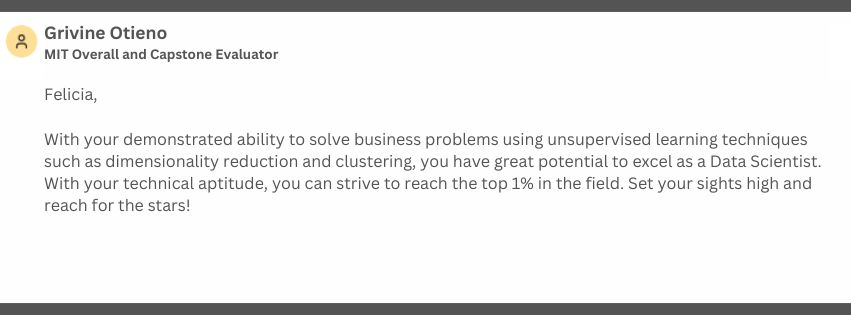
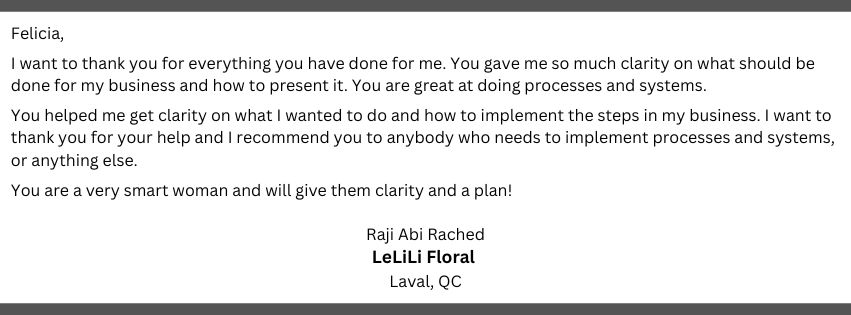
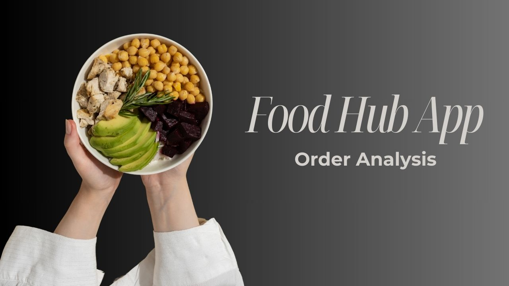
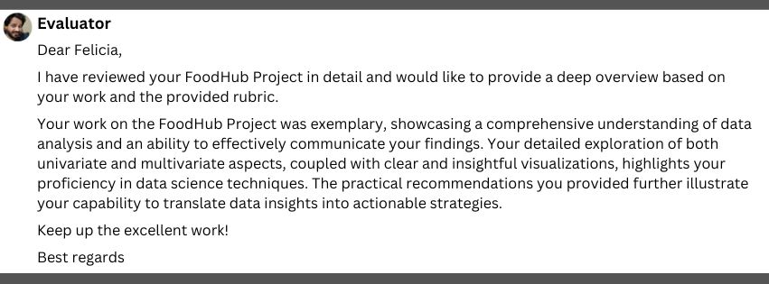
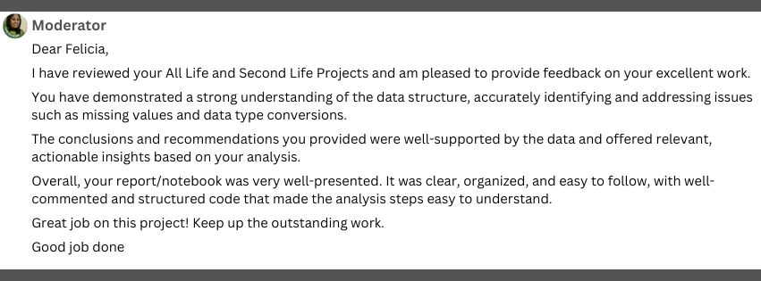
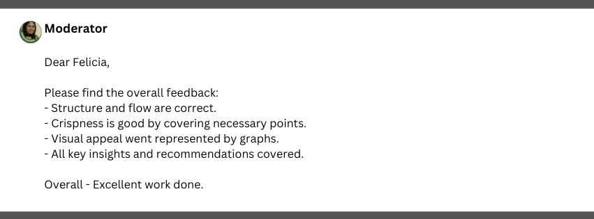

# Analyst / Operations / Project Management
              
## <ins>Education</ins>
- MASSACHUSETTS INSTITUTE OF TECHNOLOGY 
- UNIVERSITY OF SOUTHERN MISSISSIPPI 

## <ins>Skills</ins>
- Wealth Management 
- Data Analysis
- Data Validation & Reconciliation
- Data Governance & Management
- System Enhancements & Improvements
- Data Modeling
- Data Migration
- Advanced Reporting
- Python Coding and Advanced Excel
- Communication  and Collaboration Skills
- Analytical
- Detail Oriented
- Organized
- Self-Starter and Proactive

## <ins>Experience</ins> 
### ▪️ SYSTEMS AND OPERATIONS ANALYST ▪️
***Cetera Advisor Networks - Shoemaker Financial, RIA  |  2020 – Present***
- Ensured accurate reporting of several billion in assets.
- Discovered and developed a solution to resolve inaccurate reporting in software, due to third party carrier coding.
- Spearheaded, implemented roadmaps, and carried out multiple projects to understand and resolve issues affecting business. operations, and solve framework needs around operational processes.
- Discovered code glitch effecting nearly 1,000 accounts and impacting business processing during a critical season of regulatory deadlines. Immediately took corrective action to solve the issue.  
- Impacted organizational change by providing insights on business processes along with actionable changes and/or improvements. 

### ▪️ PRACTICE MANAGER ▪️
***Cetera Advisor Networks - Shoemaker Financial, RIA  |  2020 – Present***
- Developed close working relationships and collaborated with outside vendors, back-office professionals, and home office management on business decisions and problem resolution
- A trusted, all-access source for staff and other financial professionals when needing assistance solving a problem, navigating software, contacting third-party vendors, and troubleshooting unique situations.
- Maintained manual databases to satisfy reporting where software systems lacked capabilities.
- Perform administrative duties and service existing and new client accounts in every capacity.

### ▪️ FINANCIAL SERVICES PROFESSIONAL ▪️
***Cetera Advisor Networks - Shoemaker Financial, RIA  |  2020 – Present***
- Successfully negotiated several million in client account retainment to maintain and create increased revenue.
- Produced yearly reports to comply with regulations.
- Effectively answered clients' questions about their accounts and/or products in a way they understood; giving them clarity and deepening my relationship with them, which contributed to their confidence in our team.

### ▪️ FOUNDER ▪️
***Good Works Enterprises, LLC  |  2017 - 2020***
- Provided clarity on goals and a plan to accomplish such via Operational and Strategy Consulting Services to other business owners. 
- Established and responsible for foundational processes for business operations and growth.
- Built and maintained website, sales funnels, and marketing campaigns.
- Managed partnerships and strategic business connections by negotiating contract terms and cultivating relationships.
- Collaborated with legal, accounting, and other professional teams to review and maintain business licenses and documentation.

## <ins>Projects</ins>

**- Statistics, Descriptive & Qualitative Analysis**

[Food Hub App Business Report](https://github.com/FeliciaHester/Food-Hub-App-Project/blob/main/ePortfolio_Food%20Hub%20Order%20Project_PDF.pdf) 

[Food Hub App Coding Notebook](https://github.com/FeliciaHester/Food-Hub-App-Project/blob/main/1_21_25_Copy_of_Food_Hub_Project.ipynb)

Provided key measurable insights surrounding food orders made through the Food Hub App. The goal of the company was to improve customer experience, with the future intention to drive more business to the Food Hub app. Identified what type cuisine the majority of users are ordering, the most popular ordering times, and the median price point of their orders. My findings identified the net revenue generated per order with examples of strategic recommendations for a full circle marketing approach to their growth objective.

**- Segmentation, Standardization Method, PCA Technique, K-Medoids Method, Gaussian Mixture Models (GMMs)**

[All Life Bank Business Report](https://github.com/FeliciaHester/All-Life-Bank-Project/blob/main/ePortfolio_All%20Life%20Bank%20Project_PDF.pdf)

[All Life Bank Coding Notebook](https://github.com/FeliciaHester/All-Life-Bank-Project/blob/main/1_21_25_Copy_of_All_Life_Bank_Project.ipynb)

Identified existing All Life Bank customer groups and gained insight into their spending habits and behaviors. Segmented customer groups which could be marketed to, for various goals in line with All Life’s focus in the coming financial year, and to address known challenges across various departments. Provided actionable solutions to equip the Marketing and Operations Team in their objectives, along with enough data from my analysis to foster additional campaigns beneficial to AllLife in support of their goals.

**- PCA Technique, t-SNE Technique, Dimensionality Reduction**

[Second Life Automotive Business Report](https://github.com/FeliciaHester/Second-Life-Automotive-Project/blob/main/ePortfolio_Second%20Life%20Automotive%20Project_PDF.pdf)

[Second Life Automotive Coding Notebook](https://github.com/FeliciaHester/Second-Life-Automotive-Project/blob/main/1_21_25_Copy_of_Second_Life_Automotive_Project.ipynb)

Analyzed Second Life's past sales from their outlets across the U.S. Provided what dominate attributes were present in the varying groups of cars, and insight into consumer groups who previously purchased. Findings equipped Second Life with a well-rounded selection of features to fill their inventory and recommendations on how to utilize their hot market as a resource to increase sales. 

**- Unsupervised Learning using T-SNE, PCA, Clustering via K-Means, and Heatmapping**

[Capstone Marketing Segmentation Report](https://github.com/FeliciaHester/Capstone-Marketing-Segmentation/blob/main/ePortfolio_Capstone_Marketing_Segmentation_PDF.pdf)

[Capstone Marketing Segmentation Coding Notebook](https://github.com/FeliciaHester/Capstone-Marketing-Segmentation/blob/main/1_21_25_Copy_of_Capstone_Marketing_Campaign_Project.ipynb)

Defined the most profitable segment of customers and segment of goods based on previous purchasing habits and sales. The insights were used to craft an effective marketing campaign combined with various product strategies. An abundance of correlated data was extracted to use for multiple marketing campaigns across various customer groups.

 
📍 Not Shown: Numerous financial industry related projects which can not be displayed for public viewing due to protected content.
